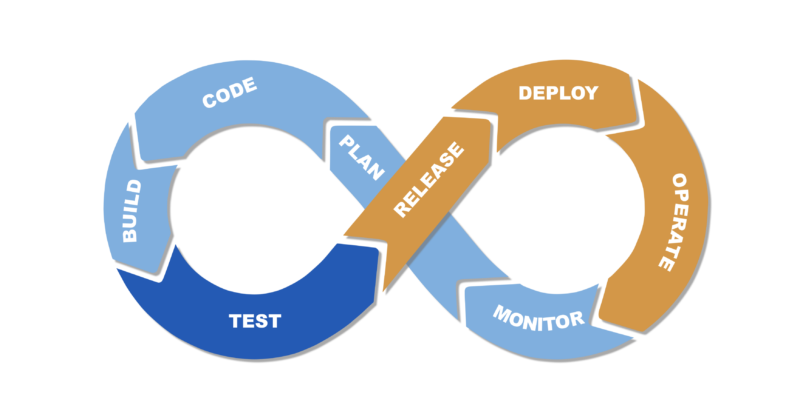
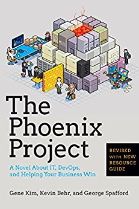
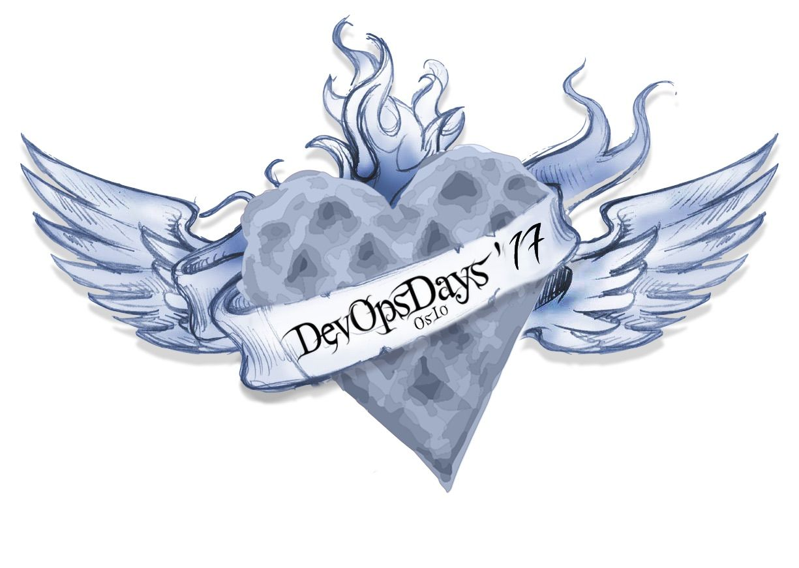

theme: Ostrich, 1
footer:   **lonix**
[.hide-footer] 

#DevOps

--- 

#Stian Buch Larsen

 

+ Working with EVRY Since **Sept. 2017**
+ Working with Docker for **5 years**
+ Co-Founder of **linuxserver.io**

^  Need to rewrite this slide to be more general and relevant.

---

##What Is DevOps

---

A **culture** and **mindset** for collaboration between developers and operations.

^ Cant Buy
Cant Hire
Not Tools
Its all about haveing several parts of you bussniss to Cooperate in a way that is designed to progress the Company needs, rather than IT´s Need.

---

> You Build It, You Run It
-- Werner Vogels, (CTO of Amazon)

---

##The Agile Manifesto

+ **Individuals and interactions** over processes and tools 
+ **Working software** over comprehensive documentation 
+ **Customer collaboration** over contract negotiation
+ **Responding to change** over following a plan

^ The Point of this slide, is that DevOps is not a new consept, it has been around for quite some time, and it relys on other standards.

---

[.build-lists: true]

# Four Pillars of DevOps

+ Culture
+ Automation
+ Measurment
+ Shareing

---

## The DevOps Cycle

---

---

#**Why**

---

DevOps emerged from an effort by businesses to respond more rapidly to market changes. 

^

Read more at https://www.ca.com/us/rewrite/articles/devops/a-short-history-of-devops.html#gwbsZvXIRWi9ygAc.99

---

###A Brief history on **DevOps** [^1]

[.build-lists: true]
[.autoscale: true]

+ 2008: Debois helps plant the seeds of the DevOps movement at the Agile conference in Toronto.
+ 2009: Flikr employees holds a talk: “10+ Deploys per Day: Dev and Ops Cooperation at Flickr.” 
+ 2010: The first US Devopsdays is organized
+ 2011: The DevOps community starts to build open source tools like Vagrant 

---

[.build-lists: true]
[.autoscale: true]

###A Brief history on **DevOps** [^1]

+ 2013: Several DevOps essential books appears. including The Phoenix Project, The lean startup and Continuous Delivery.
+ 2014: DevOps crosses into the enterprise, and established brands like Target, Nordstrom and LEGO embrace the movement.
+ 2016: The first DevOpsday Oslo is held.

---

#DevOps

---

## Recommended Futher Read

 

---

## Want to know more ? 
Attend your local DevOpsDays.
[devopsdays.org](https://www.devopsdays.org/)

---

[^1]: ca.com

^
https://www.ca.com/us/rewrite/articles/devops/a-short-history-of-devops.html#gwbsZvXIRWi9ygAc.99 #Full article on Devops History