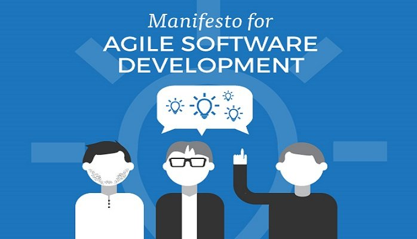

footer:   lonix
[.hide-footer] 
# DevOps

--- 

#Stian Buch Larsen

 

- Working@EVRY Since **Sept. 2017**
- Working with Containers for **5 years**
- Co-Founder **linuxserver.io**

---

^ 
- *Individuals and interactions* over processes and tools 
- *Working software* over comprehensive documentation 
- *Customer collaboration* over contract negotiation
- *Responding to change* over following a plan

---

# A culture and mindset for collaboration between developers and operations.
