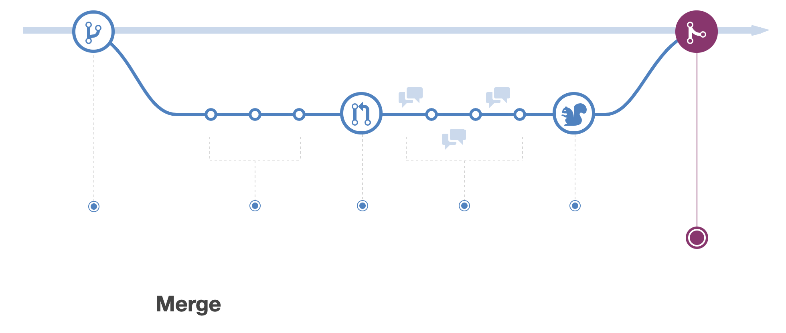

theme: Ostrich, 1
footer:   **lonix**
[.hide-footer]

# Funny title goes here

---

I Believe in the principal that everything can be written in/as Code

+ Documentation
+ Infrastructure
+ Testing
+ Automation
+ Insights
+ Powerpoint Presentations (yes really)

---

> Fail Fast
> Fail Early
> Fail Often

^The core principal around failing fast, early and often is failure is what we learn from, grow from. failing early is **a lot** cheaper than failing late.  and failing often prepares one for better for unexpected situations.

---
[.build-lists: true]

# Four Pillars of DevOps

+ Culture
+ Automation
+ Measurement
+ Sharing

---

## The Agile Manifesto

+ **Individuals and interactions** over processes and tools
+ **Working software** over comprehensive documentation
+ **Customer collaboration** over contract negotiation
+ **Responding to change** over following a plan

^ The Point of this slide, is that DevOps is not a new concept, it has been around for quite some time, and it relies on other standards.

---

How do we start

---

# Tools of choice

CONTENT

---

# VSCode

+ Versatile
+ Expandable
+ Fast
+ Free (as in beer and is in freedom)

---

Git(hub)

```shell
git clone github.com/lonix/presentation
git checkout -b issue-14
git add my new file
git commit -m "this fixes #14"
git push --remote origin
```

---

# Github Flow


^We create a branch based on a "work order" (bug/feature request etc).

---

# Github Flow


^Then we work on our code and makes commits (main rule is 1 change is 1 commit)

---

# Github Flow


^once we are done with our work we open a pull request implying our desire to make our code part of the main code base.

---

# Github Flow


^Discussion and review time. At this stage some *magic* will occur and we will run the code against linting, and testing. and other team members can weigh in, in all cases code should be looked at and approved by at least 1 member not involved in the code authoring

---

# Github Flow


^Deployment time. (this is done in conjunction with the next step)

---

# Github Flow



^Code is merged into "master" branch and deployed to live environments

---

Terraform(cloud)

---

Ansible

---

Azure

---

SignalFX

---

## Now Go away <br> I need more coffee
